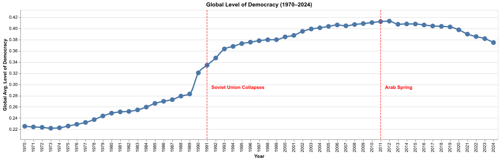
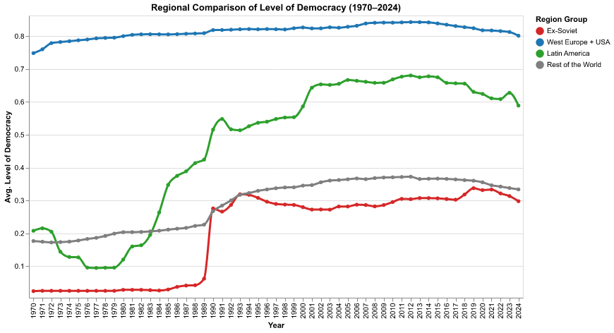
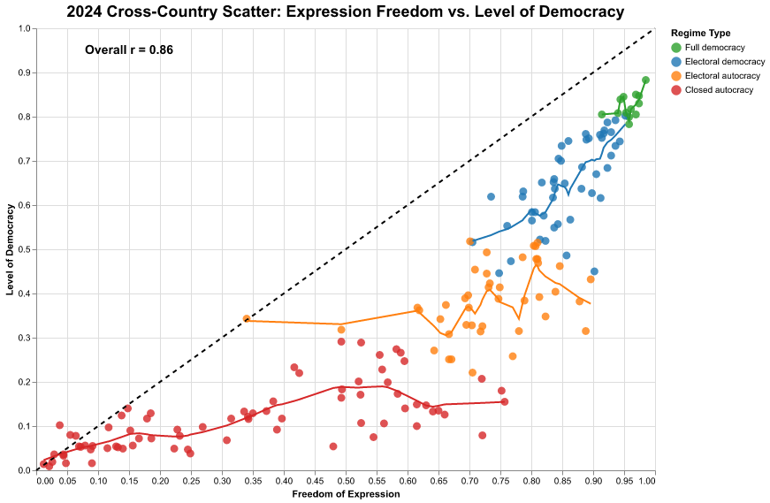
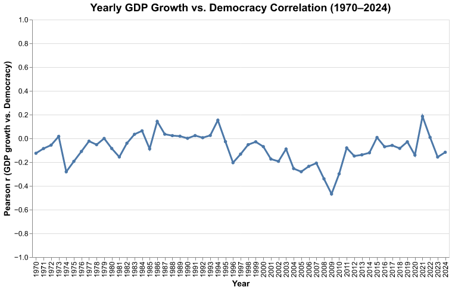
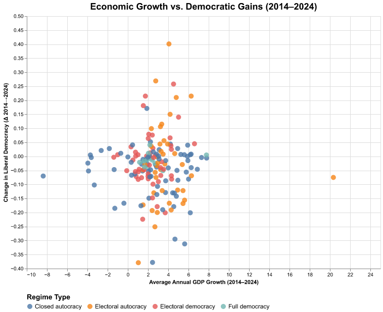
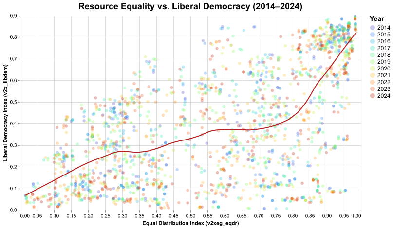
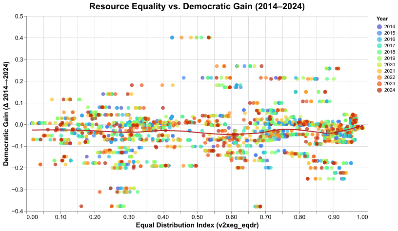
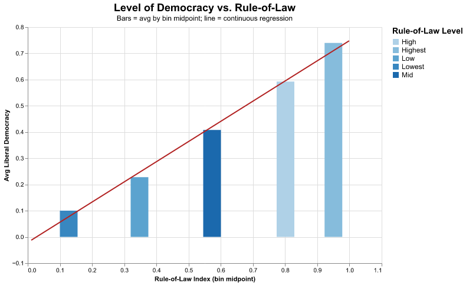
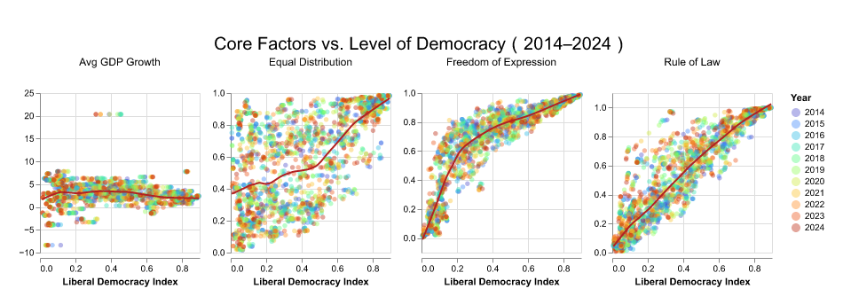
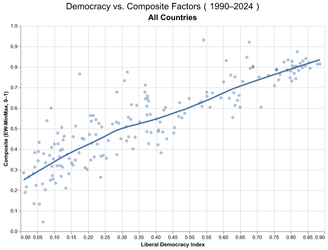

# Democracy and its Origin

Jiahang Luo

## What is your current goal? Has it changed since the proposal?

My current goal is to visualize how institutional quality and democratic indicators relate to economic performance and resilience using the V-Dem dataset and complementary World Bank data. This goal remains consistent with my original proposal, but I refined the variable selection: some factors like education were dropped due to extensive missing data in developing countries. The project now focuses on consistently available indicators—such as rule of law, equality, and freedom of expression—to ensure comparability across countries while still highlighting global and regional patterns of democratic resilience.

## Are there data challenges you are facing? Are you currently depending on mock data?

Yes, I am facing several data challenges. The main issue is the large size of the V-Dem dataset—when processing the full country-year panel, the notebook often hits the maximum row display limit, and some operations take up to 10 minutes to run without producing results. I also encounter difficulties handling outliers that distort visual scales and regression patterns, especially for smaller or conflict-affected countries. Despite these challenges, I am using only real data from V-Dem and the World Bank, not mock data.

## Describe each of the provided images with 2-3 sentences to give the context and how it relates to your goal.

 
I first aim to give viewers a basic understanding of how global democracy has evolved over the years. To provide context, I highlight two influential events — the collapse of the Soviet Union and the Arab Spring — to illustrate their potential impact. The dot and trend graphs accurately depict these changes over time.

 
After examining the overall global trend and identifying periods of average increase in democracy, it is now important to explore how countries in different regions have performed. For instance, was the rise in democracy following the collapse of the Soviet Union driven primarily by former Soviet states, or were other regions also contributing to this trend? To address this question, I created this graph to illustrate regional differences in democratic development over time.

 
This graph examines how the level of democracy relates to freedom of expression — often considered its cornerstone. It also explores whether freedom of expression helps build democracy in less democratic countries or mainly strengthens it in those already democratic.

This time-series tracks the annual correlation between GDP growth and democracy. The fluctuating pattern—with negative or near-zero correlation in most years—suggests economic growth alone does not determine democratic progress.

This scatterplot compares average annual GDP growth with changes in democracy over the past decade, colored by regime type. The diffuse clustering indicates no clear growth-democracy link, regardless of their current status quo.

Each dot represents a country-year observation, showing that nations with higher equality in resource distribution tend to exhibit stronger democratic performance. The time gradient indicates stable, moderate improvement over the past decade among mid-level democracies.

This scatterplot explores whether equality predicts recent democratic progress. The near-flat trend line implies that although equality aligns with high democracy levels, it does not consistently predict short-term democratic gains, suggesting other factors are at play.

This bar-and-line hybrid plot shows how higher rule-of-law scores correspond closely with liberal democracy levels. The consistent upward trend underscores rule of law as one of the most reliable predictors of democratic stability across countries.

This panel compares four facilitators—GDP growth, equality, freedom of expression, and rule of law—against democracy. Institutional variables (freedom, rule of law) show stronger and more stable relationships than economic growth. It has a clear comparsion between each factor.

This scatterplot links the liberal democracy index with a composite score of structural facilitators such as rule of law, equality, and freedom of expression. The positive nonlinear relationship suggests that improvements in institutional and social equality tend to reinforce democratic quality. It serves as a conclusion for all of previous graphs.

## What form do you envision your final narrative taking? (e.g. An article
I envision my final narrative taking the form of a poster that visually summarizes the key relationships between democracy, institutional quality, and socioeconomic factors. The poster will combine concise text, annotated charts, and color-coded visual comparisons to highlight global and regional patterns from 1970–2024. It will be organized around three sections: (1) long-term global and regional trends, (2) institutional drivers such as rule of law and freedom of expression, and (3) resilience and outlier cases. 
